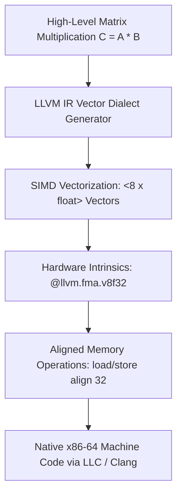

# 24 - Vectorized AI Tensor Kernel Compiler (LLVM IR)

## Executive Overview
A domain-specific tensor compiler backend generating hand-optimized **LLVM Intermediate Representation (LLVM IR)**. It generates 8-lane single-precision SIMD vector code targeting AVX2 / AVX-512 with hardware fused multiply-add (`@llvm.fma.v8f32`) intrinsics, 32-byte aligned loads, and unrolled loops.

## Compiler Vectorization Pipeline



### Source Tree
- **`src/tensor_kernel.ll`**: Pure LLVM IR defining vectorized tensor multiply-accumulate kernels.
- **`src/build_ir.sh`**: Compilation script using `llc` and `clang`.
- **`runner/run.js`**: Static LLVM IR validator and execution simulator.

## Vectorized LLVM IR Excerpt
```llvm
define void @tensor_gemm_8x8_fma(
    float* noalias nocapture readonly %A,
    float* noalias nocapture readonly %B,
    float* noalias nocapture %C
) {
    %vA = load <8 x float>, <8 x float>* %ptrA, align 32
    %vB = load <8 x float>, <8 x float>* %ptrB, align 32
    %vC = load <8 x float>, <8 x float>* %ptrC, align 32
    %res = call <8 x float> @llvm.fma.v8f32(<8 x float> %vA, <8 x float> %vB, <8 x float> %vC)
    store <8 x float> %res, <8 x float>* %ptrC, align 32
    ret void
}
```

## Native LLVM Compilation
```bash
llc -O3 -mattr=+avx2,+fma src/tensor_kernel.ll -o tensor_kernel.s
clang -O3 -c src/tensor_kernel.ll -o tensor_kernel.o
```

## Universal Verification
```bash
node runner/run.js
node orchestrator/run.js --project=24-llvm
```

## Senior Interview Q&A
- **Q: Why use `@llvm.fma.v8f32` instead of separate multiply and add?** Fused Multiply-Add (FMA) executes $A \times B + C$ in a single CPU cycle with a single rounding step, doubling floating-point throughput while improving numerical accuracy.
- **Q: Why is `align 32` crucial in vector loads?** AVX2 operates on 256-bit registers (32 bytes). Aligned vector instructions (`vmovaps`) execute faster than unaligned loads (`vmovups`) and prevent CPU penalty cycles when crossing 64-byte cache line boundaries.\n